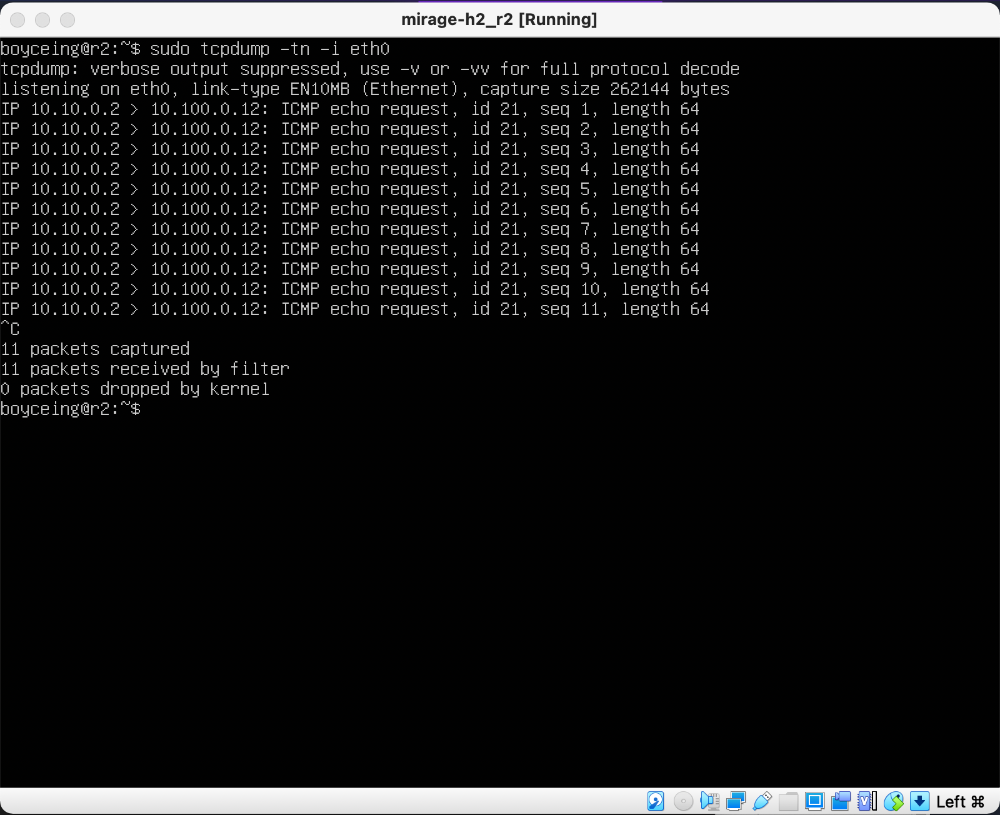
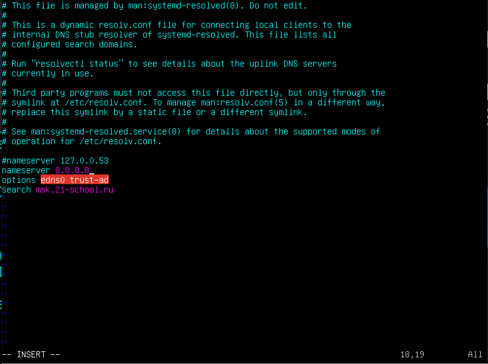

# Linux Network 0_0
<font size="1">

## [Part 1](#part-1-ipcalc-tool)
### &emsp; [1.1 Network and Masks](#part-1-ipcalc-tool)
### &emsp; [1.2 localhost](#part-1-ipcalc-tool)
### &emsp; [1.3 Network ranges and segments](#part-1-ipcalc-tool)
<hr>

## [Part 2](#part-2-static-routing-between-two-machines)
### &emsp; [2.1 Adding a static route manually](#part-2-static-routing-between-two-machines)
### &emsp; [2.2 Adding a static route with saving](#part-2-static-routing-between-two-machines)
<hr>

## [Part 3](#part-3-iperf3-utility)
### &emsp; [3.1 Connection speed](#part-3-iperf3-utility)
### &emsp; [3.2 iperf3 utility](#part-3-iperf3-utility)
<hr>

## [Part 4](#part-4-network-firewall-)
### &emsp; [4.1 iptables utility](#part-4-network-firewall)
### &emsp; [4.2 nma utility](#part-4-network-firewall)
<hr>

## [Part 5](#part-5-static-network-routing)
### &emsp; [5.1 Configuration of machine addresses](#part-5-static-network-routing)
### &emsp; [5.2 Enabling IP forwarding](#part-5-static-network-routing)
### &emsp; [5.3 Default route configuration](#part-5-static-network-routing)
### &emsp; [5.4 Adding static routes](#part-5-static-network-routing)
### &emsp; [5.5 Making a router list](#part-5-static-network-routing)
### &emsp; [5.6 Using ICMP protocol in routing](#part-5-static-network-routing)
<hr>

## [Part 6](#part-6-dynamic-ip-configuration-using-dhcp)
<hr>

## [Part 7](#part-7-nat)
<hr>

## [Part 8](#part-8-bonus-introduction-to-ssh-tunnels)
<hr>

</font>


## Part 1. ipcalc tool

### 1.1 Network and masks

- Network address 
    - 192.167.38.54/13
        - 192.160.0.0

- conversion of the mask:
    - 255.255.255.0
        - prefix: /24
        - binary: 11111111.11111111.11111111.00000000
    - /15
        - normal: 255.254.0.0
        - binary: 11111111.11111111.00000000.00000000
    - 11111111.11111111.11111111.11110000
        - normal: 255.255.255.240
        - prefix: /28

- Minimum and maximum host in 12.167.38.4 network with masks:
    - /8 : 12.0.0.1 - 12.255.255.254
    - 11111111.11111111.00000000.00000000 : 12.167.0.1 - 12.167.255.254
    - 255.255.254.0 : 12.167.38.1 - 12.167.39.254
    - /4 : 0.0.0.1 - 15.255.255.254

### 1.2 localhost

Define and write in the report whether an application running on localhost can be accessed with the following IPs: 194.34.23.100, 127.0.0.2, 127.1.0.1, 128.0.0.1

- 194.34.23.100 - no
- 127.0.0.2 - yes
- 127.1.0.1 - yes
- 128.0.0.1 - no

### 1.3 Network ranges and segments

- Which of the listed IPs can be used as public and which only as private:
    - 10.0.0.45 - private
    - 134.43.0.2 - public
    - 192.168.4.2 - private
    - 172.20.250.4 - private
    - 172.0.2.1 - public
    - 192.172.0.1 - public
    - 172.68.0.2 - public
    - 172.16.255.255 - private
    - 10.10.10.10 - private
    - 192.169.168.1 - public

- Which of the listed gateway IP addresses are possible for 10.10.0.0/18 network:
    - 10.0.0.1 - no
    - 10.10.0.2 - yes
    - 10.10.10.10 - yes
    - 10.10.100.1 - no
    - 10.10.1.255 - no

## Part 2. Static routing between two machines

View existing network interfaces with the ip a command


### 2.1. Adding a static route manually

> output of the ```ip a``` command on ws1 and ws2

Describe the network interface corresponding to the internal network on both machines and set the following addresses and masks: ws1 - 192.168.100.10, mask */16 *, ws2 - 172.24.116.8, mask /12


> changes to 00-installer-config.yaml files on both machines

Run the ```netplan apply``` command to restart the network service


> netplan apply on both machines

Add a static route from one machine to another and back using a
```ip r add``` command.

Ping the connection between the machines


> creating static connection between ws1 and ws2 and ping

### 2.2. Adding a static route with saving
Restart the machines
Add static route from one machine to another using etc/netplan/00-installer-config.yaml file


> adding static routes to .yaml file

Ping the connection between the machines


> ping

## Part 3. iperf3 utility

### 3.1. Connection speed

Convert and write results in the report: 8 Mbps to MB/s, 100 MB/s to Kbps, 1 Gbps to Mbps

- 8 Mbps = 1 MB/s
- 100 MB/s = 819200 Kbps
- 1 Gbps = 1024 Mbps

### 3.2. iperf3 utility

Measure connection speed between ws1 and ws2


## Part 4. Network firewall

### 4.1. iptables utility
Create a /etc/firewall.sh file simulating the firewall on ws1 and ws2

The following rules should be added to the file in a row:
1) on ws1 apply a strategy where a deny rule is written at the beginning and an allow rule is written at the end (this applies to points 4 and 5)
2) on ws2 apply a strategy where an allow rule is written at the beginning and a deny rule is written at the end (this applies to points 4 and 5)
3) open access on machines for port 22 (ssh) and port 80 (http)
4) reject echo reply (machine must not ping, i.e. there must be a lock on OUTPUT)
5) allow echo reply (machine must be pinged)


> creating firewall.sh

Run the files on both machines with chmod +x /etc/firewall.sh and /etc/firewall.sh commands


> firewall running

<b>The difference is that the if the DROP rule stands before an ACCEPT rule it will disable any of them</b>
<hr>
<b>Разница в том, что если запрещающее правило стоит первым, то следующее разрешающее правило не будет работать</b>

## Part 5. Static network routing

### 5.1. Configuration of machine addresses

Set up the machine configurations in etc/netplan/00-installer-config.yaml according to the network in the picture.

)


> Static ip settings to all machines and routers

Restart the network service. If there are no errors, check that the machine address is correct with the ip -4 acommand. Also ping ws22 from ws21. Similarly ping r1 from ws11


> netplan applied and ping 


### 5.2. Enabling IP forwarding

To enable IP forwarding, run the following command on the routers:
`sysctl -w net.ipv4.ip_forward=1`


> With this approach, the forwarding will not work after the system is rebooted

Open /etc/sysctl.conf file and add the following line:
`net.ipv4.ip_forward = 1`


> permanent forwarding

### 5.3. Default route configuration

Configure the default route (gateway) for the workstations. To do this, add default before the router's IP in the configuration file


> gateway config in yaml

Call `ip r` and show that a route is added to the routing table


> ip r call after setting gateway

Ping r2 router from ws11 and show on r2 that the ping is reaching. To do this, use the `tcpdump -tn -i eth0`
command.



### 5.4. Adding static routes

Add static routes to r1 and r2 in configuration file


Call `ip r` and show route tables on both routers


Run `ip r list 10.10.0.0/[netmask]` and `ip r list 0.0.0.0/0` commands on ws11


- Маршрут подбирается по таблице марштрутизаторов. Если маршрут выбран успешно то он будет передан. Если не успешно - пакет не будет передан. Если несколько совпадений - то для переадсресации будет выбран маршрут с самой длинной маской.

### 5.5. Making a router list

Run the `tcpdump -tnv -i eth0` dump command on r1
Use traceroute utility to list routers in the path from ws11 to ws21


### 5.6. Using ICMP protocol in routing

Run on r1 network traffic capture going through eth0 with the
`tcpdump -n -i eth0 icmp` command

Ping a non-existent IP (e.g. 10.30.0.111) from ws11 with the
`ping -c 1 10.30.0.111` command


## Part 6. Dynamic IP configuration using DHCP

For r2, configure the DHCP service in the /etc/dhcp/dhcpd.conf file:
1) specify the default router address, DNS-server and internal network address


2) Write nameserver 8.8.8.8. in a resolv.conf file


Restart the DHCP service with `systemctl restart isc-dhcp-server`. Reboot the ws21 machine with reboot and show with ip a that it has got an address. Also ping ws22 from ws21.


Specify MAC address at ws11 by adding to etc/netplan/00-installer-config.yaml


Сonfigure r1 the same way as r2, but make the assignment of addresses strictly linked to the MAC-address (ws11). Run the same tests
Request ip address update from ws21


## Part 7. NAT

In /etc/apache2/ports.conf file change the line `Listen 80` to `Listen 0.0.0.0:80` on ws22 and r1, i.e. make the Apache2 server public


Start the Apache web server with `service apache2 start` command on ws22 and r1


Add the following rules to the firewall, created similarly to the firewall from Part 4, on r2:

1) Delete rules in the filter table - `iptables -F`
2) Delete rules in the "NAT" table - `iptables -F -t nat`
3) Drop all routed packets - iptables `--policy FORWARD DROP`
Run the file as in Part 4
Check the connection between ws22 and r1 with the `ping` command


> When running the file with these rules, ws22 should not ping from r1

Add another rule to the file:

4) Allow routing of all ICMP protocol packets
Run the file as in Part 4
Check connection between ws22 and r1 with the `ping` command


> When running the file with these rules, ws22 should ping from r1

Add two more rules to the file:

5) Enable SNAT, which is masquerade all local ip from the local network behind r2 (as defined in Part 5 - network 10.20.0.0)
6) Enable DNAT on port 8080 of r2 machine and add external network access to the Apache web server running on ws22

**!DISABLE NAT!**


## Part 8. Bonus. Introduction to SSH Tunnels

Run a firewall on r2 with the rules from Part 7

Start the Apapche web server on ws22 on localhost only (i.e. in /etc/apache2/ports.conf file change the line `Listen 80` to Listen `localhost:80`)

Use Local TCP forwarding from ws21 to ws22 to access the web server on ws22 from ws21

Use Remote TCP forwarding from ws11 to ws22 to access the web server on ws22 from ws11

To check if the connection worked in both of the previous steps, go to a second terminal 


For connecting to either remote or local ssh server you need to enable password login in `/etc/ssh/sshd_config` file and restart ssh server
otherwise you will not be able to connect to the ssh server via password 

